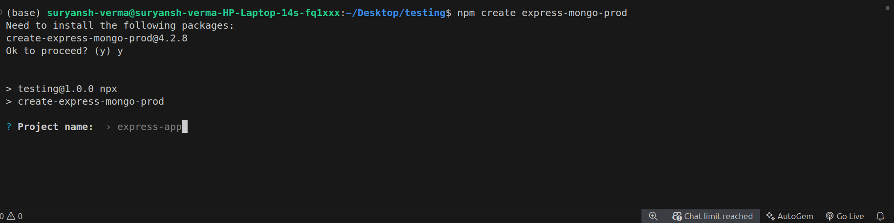
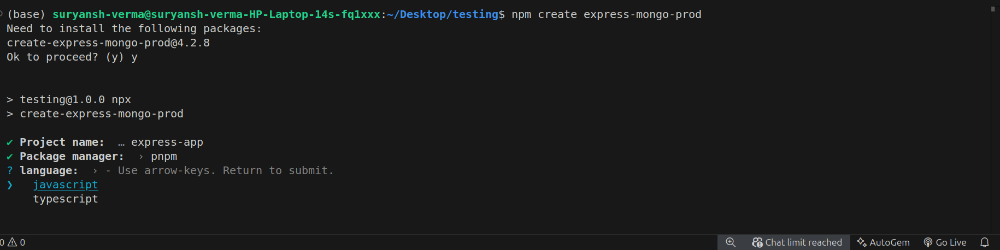
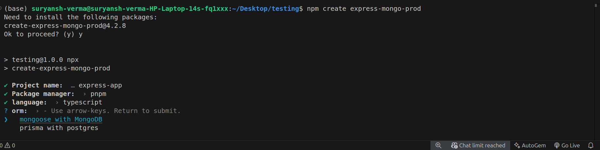
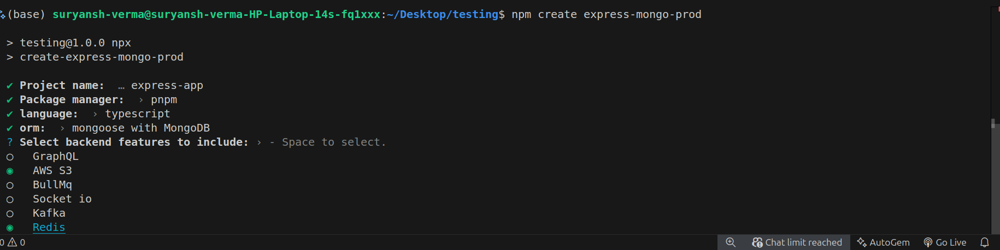

# Production setup of nodejs
This guide provides a step-by-step walkthrough to configure, deploy, and run your Node.js application created using create-express-mongo-prod in a production environment.

### ✅ Prerequisites
- Ensure the following are installed on your system:
- Node.js ≥ 18.x
- Docker ≥ 20.x
- Docker Compose ≥ 2.x
- Git
- Any of the following:
    - MongoDB / PostgreSQL (local or remote)
    - AWS account/Supabase s3 (for S3) (if you want to use aws-s3)
    - Redis (if selected)
    - Kafka broker (if selected)
    - BullMq (if selected)

### 1️⃣ Create a New Project
```
npm create express-mongo-prod
```
or
```
pnpm create express-mongo-prod
```
or
```
yarn create express-mongo-prod
```
- Enter project name or default to express-app

- Select package manager and language

- Select ORM

- Select features by space button which you want to include in your project


### 📁 Folder Structure
This is the scalable and preferred folder structure for developers to work within a team.
```
express-app/
├── .dockerignore
├── .gitignore
├── .husky/
├── .github/
├── docker-compose.yml
├── Dockerfile
├── eslint.config.mjs
├── package.json
├── readme.md
├── tsconfig.json
├── src/
│   ├── config/
│   ├── controllers/
│   ├── middlewares/
│   ├── models/
│   ├── routes/
│   ├── s3/
│   ├── services/
│   ├── types/
│   ├── utils/
│   └── index.ts
```
#### 📂 src
Main folder for our app. All source code will be there.

- `src/config`: All config files will be there like mongoDB connection, prisma connection or all files.
- `src/controllers`: All controllers are will be written in this folder.
- `src/models`: If you are using mongoDB then this folder will be there and includes all mongoDB schema files.
- `src/routes`: App's all routes will be here.
- `src/services`: If you select services like kafka, bullMQ, Redis then this folder exist and all services will be there.
- `src/utils`: All utility files is here.
- `src/index.js`: Main file where server start.

#### 📂 Other files and folders

- `Dockerfile`: Dockerfile is used for dockerise you app. Dont do anything it will auto generate by `docker build -t myapp .`
- `docker-compose.yml`: docker compose file for local development.
- `.github`: Includes issue and pull request templates for github.
- `.husky`: husky configuration.
- `.dockerignore`: docker ignore file
- `.gitignore`: git ignore file
- `eslint.config.mjs`: For linting
- `package.json`: dependencies folder
